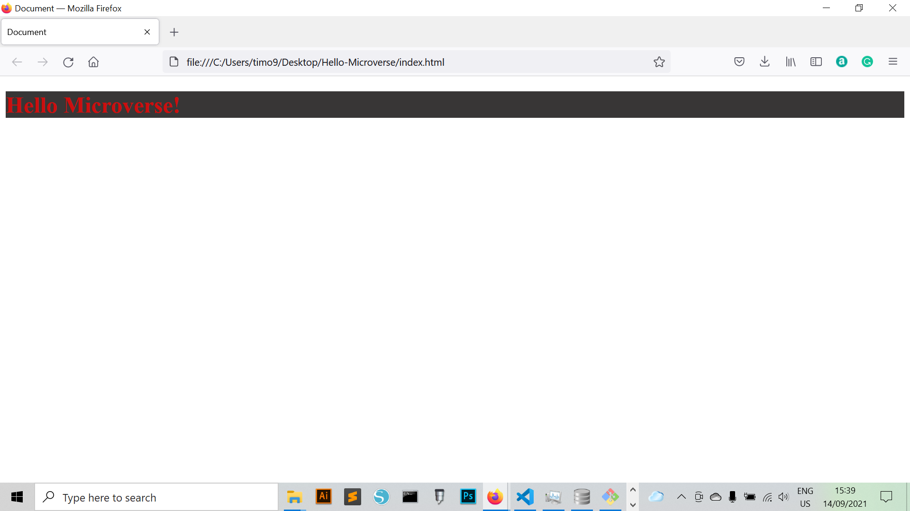

# Project Name

> Hello Microverse!

This is my Hello Microverse! repository.

## Built With

- HTML
- CSS
- Nodejs
- NPM

## Live Demo

[Live Demo Link](https://livedemo.com)

## Getting Started

To create a copy of this project, download it using github desktop or download as zip. To work further on this project, fork the repository and create a local clone of your fork.

### Usage

Once downloaded on your local machine cd into the root folder using a terminal and run: node index.html

## Authors

👤 **Author1**

- GitHub: [@githubhandle](https://github.com/Timowest12)
- Twitter: [@twitterhandle](https://twitter.com/Timo61060367)
- LinkedIn: [LinkedIn](https://www.linkedin.com/in/timo-wester-6a0282a7/)

## 🤝 Contributing

Contributions, issues, and feature requests are welcome!

Feel free to check the [issues page](../../issues/).

## Show your support

Give a ⭐️ if you like this project!

## 📝 License

This project is [MIT](./MIT.md) licensed.
